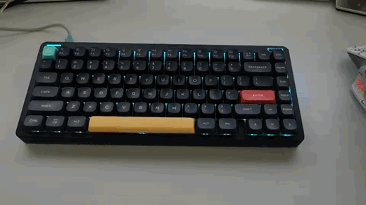

# Agent Status Lights

把编码 agent 的状态映射到 QMK 键盘的背光上。**执行中 / 等待权限 / 工具失败 / 全部完成 /
语音输入** —— 状态用**运动**区分，颜色只是强化：余光扫过时「一个点在转圈」和「整环一起明灭」
能分辨，两种红色不能。



支持 **Claude Code** 和 **Codex CLI**，本机会话走 hook，Orca 里的远程会话走轮询。
键盘靠 VIA 的 raw HID 接口发现，不依赖固定的 VID/PID。

刷过本仓库固件补丁的 Halo65 V2 **蓝牙下也能用**：状态灯照常跟随，改配置慢一些
（走键盘 LED 位的低速通道，改一种颜色约 8 秒），App 里是同一套菜单。
细节在 [AGENTS](docs/AGENTS.md) 的「无线通道」一节。2.4G 接收器不支持。

---

## 安装

把下面这段粘贴给 Claude Code 或 Codex：

```text
帮我安装 https://github.com/RainGiving/agent-status-lights ：克隆仓库后，严格按照仓库里的
docs/AI-INSTALL.md 执行，遇到需要我动手的步骤停下来问我。如果我的键盘不是
NuPhy Halo65 V2，按文档里的适配分支告诉我哪些功能可用。
```

它会照 [`docs/AI-INSTALL.md`](docs/AI-INSTALL.md) 走完扫描、安装、验收，遇到要你动手的
地方（只有刷固件那一步）会停下来问。

自己安装也可以：

```bash
/usr/bin/python3 scripts/install.py scan      # 只读，看接了什么键盘、它有哪些灯
/usr/bin/python3 scripts/install.py install   # 安装服务和 hooks
/usr/bin/python3 scripts/install.py install-app
```

装完**用 Command + Q 完全退出 Claude Code 再打开** —— hook 是启动时读的，关窗口不算。

需要：macOS、USB 数据线直连的 QMK/VIA 键盘、Xcode Command Line Tools、
系统自带的 `/usr/bin/python3`。

## 长什么样

默认**只有中间的键区背光会动**，四边的 Halo 环形灯不动。

| 状态 | 内圈 · 键区背光（默认开） | 外圈 · Halo 环（默认关） |
| --- | --- | --- |
| 执行中 | 色带，跟随外圈色 | **彗星绕圈** 青 `#00A8FF` |
| 等待权限 | 色带，跟随外圈色 | **整环脉冲** 琥珀 `#FFB000` |
| 工具失败 | 纯色，跟随外圈色 | **快闪** 红 `#FF2020`，保护窗 4 秒 |
| 全部完成 | 纯色，跟随外圈色 | **扫圈填满** 绿 `#00E060`，倒计时 10 秒 |
| 语音输入 | 纯色，跟随外圈色 | **纯色不动** 紫 `#A855F7` |
| 默认 / 空闲 | 恢复你原本的灯效 | 交还固件 |

外圈默认关着，因为它是唯一一件原厂键盘做不到的事 —— 它在 VIA 上根本不存在，必须刷本项目的
固件补丁。默认打开的话，没刷过固件的键盘装完只会看起来是坏的。

多个会话同时跑时取优先级最高的：**语音输入 > 工具失败 > 等待权限 > 执行中 > 全部完成 >
默认**。语音输入排在最前，因为其余状态说的是后台在做什么，它说的是你此刻正在做什么。

「全部完成」是一次性提示：被任何新状态打断后不再恢复，没被打断时倒计时结束熄灭。
倒计时和失败保护窗的时长都在设置 App 对应状态的页面里调。细节在 [AGENTS](docs/AGENTS.md)。

## 语音输入

按下你自己的语音输入快捷键时，灯变成另一套效果，松开就回到当时该显示的状态。默认关着，
在设置 App 的「语音输入」页打开。

两种触发方式，可以只用一种，也可以两种任选其一生效：

| 方式 | 需要的权限 | 什么时候亮 |
| --- | --- | --- |
| 快捷键 | 输入监控 | 按下配置的组合键时。可以选按住或按一下切换 |
| 麦克风被占用 | 不需要 | 默认输入设备开始录音时。任何应用录音都算 |

快捷键**按事件看到的样子填**，不是按键帽上印的字。系统设置里把 Control 和 Command
对调过的话，物理 Command 键发出来的是 `⌃`，微信的「左 Command + 空格」在这里就是
`⌃Space`。

监听是一个独立的启动项 `halo65_voice`，它只把配置的那一个组合键的按下和松开
报给守护进程，不认识也不上报别的按键。它要单独授权：

```bash
/usr/bin/python3 scripts/install.py voice
```

这条命令会打开「系统设置 → 隐私与安全性 → 输入监控」，把
`~/Library/Application Support/ClaudeHalo65/halo65_voice` 加进去并打开开关，
然后它会重启监听进程。**每次重装二进制都要重新授权一次**，权限记在代码签名上。

## 打开外圈和远程会话

```bash
/usr/bin/python3 scripts/install.py reconnect        # 开
/usr/bin/python3 scripts/install.py reconnect --off  # 退回默认
```

设置 App 的「高级」页也有按钮。它会先探测外圈固件在不在，**探测不到就打印刷机步骤而不是
留一个无效的开关**，然后打开 Orca 桥接（远程会话）。蓝牙下探测不到 VIA，
已开启的外圈不会被它关掉。

外圈需要自编译固件，步骤和工具链的注意事项在 [`firmware/README.md`](firmware/README.md)。
**进 DFU 会清空 EEPROM，先备份改键**（`build/via_backup`）。

## 设置 App

装在 `~/Applications/HALO.app`。左侧是页面列表：

- **概览** —— 当前显示的状态和环形动画、各状态的会话数、连接方式（USB / 蓝牙）、
  外圈可控性、hooks 安装情况。
- **每个状态一页** —— 选动画、取色、调亮度速度拖尾，左边有 50 点环形实时预览，
  按固件同样的算法动。「全部完成」页有熄灭倒计时，「工具失败」页有红色保护窗，
  「语音输入」页配触发方式和快捷键。
- **Hooks / 高级** —— hook 安装状态、外圈与远程会话开关、会话清理、配置文件位置。

界面里的长说明收在 info 图标后面，悬停查看。

配置在 `~/Library/Application Support/ClaudeHalo65/settings.json`，改完立即生效。
**动画参数全部走线下发，调参不用重刷固件。**

| 字段 | 说明 |
| --- | --- |
| `zones` | `{"halo": bool, "matrix": bool}`，驱动哪些区域。关掉的完全不碰 |
| `completed_hold_seconds` | 全部完成的熄灭倒计时，秒 |
| `failure_hold_seconds` | 工具失败的红色保护窗，秒 |
| `stale_active_minutes` | 活跃会话无事件超过此时长即丢弃，分钟 |
| `halo.mode` | `solid` / `pulse` / `comet` / `strobe` / `fill` |
| `halo.param` | `comet` 的拖尾长度，或 `strobe` 的占空比（%） |
| `matrix.effect` | 1–42，QMK RGB Matrix 效果号，见 [PROTOCOL](docs/PROTOCOL.md) |
| `matrix.follow_color` | 用同状态外圈的颜色。默认开，这是两圈读起来像一个信号的原因 |
| `matrix.restore` | 不画东西，把接管前的灯效写回去。只对 `idle` 有意义 |
| `voice.trigger` | `hotkey` / `microphone` / `both` |
| `voice.keycode` | 虚拟键码，`49` 是空格 |
| `voice.modifiers` | `control` / `option` / `shift` / `command`，按事件里的名字写 |
| `voice.mode` | `hold` 按住，`toggle` 按一下切换 |
| `voice.tail_seconds` | 触发结束后再保持多久，盖住语音转文字的延迟 |

## 命令

```bash
scan [--deep] [--json]   # 只读：接了什么键盘、有哪些灯光通道
install / uninstall      # 安装，或全部移除（恢复灯效，只移除自己的 hook）
install-app / icon       # 设置 App / 生成图标
reconnect [--off]        # 外圈 + Orca 开关
voice                    # 语音输入监听：查权限、开授权面板、重启监听
status                   # 服务 / hooks / 外圈 / codex / orca / 语音 / 键盘
codex-hooks-install      # 接上 Codex CLI
send-event Stop          # 不跑真任务测状态机
```

日志：`tail -f ~/Library/Application\ Support/ClaudeHalo65/daemon.log`，
语音监听的日志在同一目录的 `voice.log`。

## 适配其他键盘

- **内圈（键区背光）开箱即用**：任何经 USB 直连、支持 VIA 且实现了 RGB Matrix
  的 QMK 键盘都能驱动。跑一次 `scan`，它会直接告诉你这块板子有什么可用。
- **外圈和蓝牙通道来自同一份固件补丁**，补丁只针对 NuPhy Halo65 V2 写成。
  别的键盘不能直接刷，但可以移植：`halo_link.[ch]` 是纯协议解码器，不含板级代码，
  可以整体搬走；动画原语和 VIA 通道处理写在 Halo65 V2 的 `side.c` / `ansi.c` 里，
  要按你的板子的灯位表重写。每个文件的改动内容见
  [`firmware/README.md`](firmware/README.md)。
- 没有独立环形灯的键盘不需要外圈：键区背光本身就能承载全部状态。

## 更多

- [**AI-INSTALL**](docs/AI-INSTALL.md) — 给 agent 看的安装 runbook
- [**AGENTS**](docs/AGENTS.md) — Codex 的边界、Orca 桥接、多会话怎么合并
- [**PROTOCOL**](docs/PROTOCOL.md) — VIA 实测记录：通道扫描、亮度 off-by-one、并发读为什么会串台
- [**firmware**](firmware/README.md) — 外圈固件补丁、构建和刷机

## 隐私

hook 客户端把原始 JSON 转发给本机 Unix socket，守护进程**只**保留 `hook_event_name` 和
`session_id`，其余全部丢弃。提示词、工具参数、工具输出都不会落盘。socket 和配置权限 `0600`。

Orca 桥接（默认关）会读远程终端的标题和预览来判断状态，这些内容同样不落盘。

## 排查

| 症状 | 先做什么 |
| --- | --- |
| 灯完全没反应 | 跑 `scan`。有线下多半是 VIA / NuPhy 官方软件独占了 raw HID，或线只能充电；蓝牙下要刷过固件补丁并给 `halo65_leds` 授权（`install.py leds`）；2.4G 不支持 |
| 只有键区亮，四边不亮 | 这是默认行为。跑 `reconnect` |
| `hooks: 0/7` | 重跑 `install`，然后 `Command + Q` 完全退出 Claude Code |
| 灯卡在某个颜色 | agent 异常退出没发 `Stop`。`send-event SessionEnd` |
| 换了图标 Dock 还是旧的 | `killall Dock` |

## 已知限制

- 只支持 macOS。扫描对任何 QMK/VIA 键盘有效，内圈原理上也通用，但**只在 NuPhy Halo65 V2
  （`19f5:3315`）上真机验证过**。
- 外圈需要自编译固件；官方固件更新会覆盖它，需要重刷。50 颗灯作为一个整体显示状态。
- 蓝牙依赖同一份固件补丁，且改配置走每秒约 16 bit 的低速通道：状态切换零点几秒，
  改一种颜色约 8 秒，一次改动太多会提示插线补全。键盘睡眠期间灯不更新。
- Codex 没有失败事件，**Codex 会话不会变红**；这条路径也还没在真机验证过。
- 远程会话只有「执行中 / 等待权限 / 完成」三档，测不出工具失败，且只覆盖 Orca 里起的会话。
- 键区背光亮度上限 254（固件 off-by-one，肉眼无差别）。

基于 [royzjq/agent-status-lights](https://github.com/royzjq/agent-status-lights) 继续开发，提交历史保留了原作者的工作。
灵感来自 [codex-kick75-status-lights](https://github.com/Pixelmoss/codex-kick75-status-lights)，
硬件层是完全重写的：那个项目走 Kick75 的私有 HID 协议，Halo65 V2 是标准 QMK + VIA。

MIT。非官方工具，与 Anthropic、OpenAI、NuPhy 均无隶属关系。
